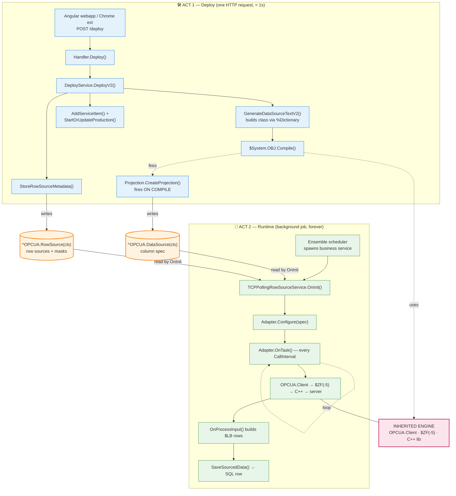
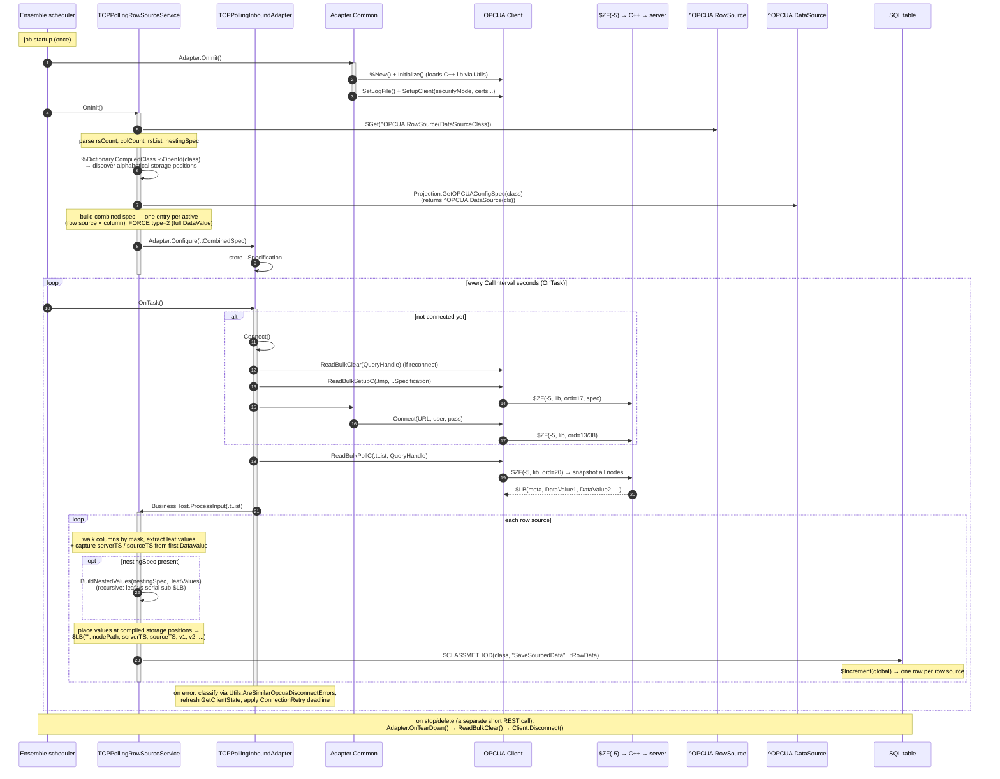
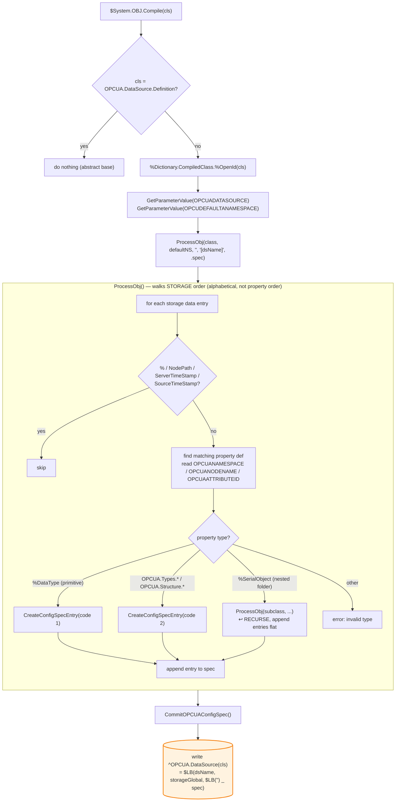

# End-to-End Workflow — Mermaid Diagrams

> Detailed call-level trace of the IRIS OPC UA Adapter, from clicking "Deploy" in the
> wizard to a running poller writing SQL rows. Method names and globals verified against
> `image-iris/src/` on 2026-06-29. Covers the **v2 row-source** path.

The system has **two phases** that never call each other directly — they hand off through
two IRIS globals (`^OPCUA.DataSource` and `^OPCUA.RowSource`):

- **ACT 1 — Deploy:** one short HTTP request. Generates + compiles a class, writes globals, adds a production item.
- **ACT 2 — Runtime:** a background job that connects once and polls forever.

---

## 0. High-level overview (the two acts + the handoff)



---

## 1. ACT 1 — Deploy (detailed call sequence)

```mermaid
sequenceDiagram
    autonumber
    participant UI as webapp / chrome-ext
    participant H as REST.Handler
    participant DS as REST.DeployService
    participant DICT as %Dictionary + OBJ.Compile
    participant PROJ as DataSource.Projection
    participant GD as ^OPCUA.DataSource
    participant GR as ^OPCUA.RowSource
    participant ENS as Ens production

    UI->>H: POST /deploy  {columns, rowSources, mode, pipelineVersion:2}
    activate H
    H->>H: GetRequestParams(.tBody)  (JSON body → %DynamicObject)
    H->>DS: Deploy(tBody, .tResult)
    activate DS
    Note over DS: Deploy() requires rowSources → forwards to DeployV2()
    DS->>DS: DeployV2(pBody, .pResult)
    activate DS

    Note over DS: validate columns / rowSources / className

    DS->>DS: GenerateDataSourceTextV2(...)
    activate DS
    DS->>DS: FindDefaultNamespace(childNodes)
    opt has nested folders
        DS->>DS: GenerateSerialClasses(class, ns, .folders, .out)
        DS->>DICT: %Dictionary.ClassDefinition (%SerialObject)<br/>%Save + OBJ.Compile  (per folder)
    end
    Note over DS: build main class: NodePath, ServerTimeStamp,<br/>SourceTimeStamp + one column per union col<br/>(MapToPlainType: Double→%Double, array→%String JSON)
    DS->>DICT: tClassDef.%Save()
    DS->>DICT: $System.OBJ.Compile(class, "ck-d")
    activate DICT
    Note over DICT,PROJ: compiling a subclass of OPCUA.DataSource.Definition<br/>auto-fires its Projection (see diagram 3)
    DICT->>PROJ: CreateProjection(cls)
    activate PROJ
    PROJ->>GD: write ^OPCUA.DataSource(cls) = $LB(name, global, colSpec)
    PROJ-->>DICT: SaveSourcedData() generated on class
    deactivate PROJ
    DICT-->>DS: compiled (SQL table now exists)
    deactivate DICT
    deactivate DS

    DS->>DS: StoreRowSourceMetadata(class, rowSources, columns)
    DS->>GR: write ^OPCUA.RowSource(cls) = $LB(rsCount, colCount, rsList, paths, nesting)

    DS->>DS: EnsureProductionExists()
    DS->>DS: AddServiceItem(pBody, class, dsName, mode)
    Note over DS,ENS: Ens.Config.Item ClassName = TCPPollingRowSourceService<br/>(or TCPSubscriptionRowSourceService); AddSetting DataSourceClass, URL, CallInterval...
    DS->>ENS: tProd.Items.Insert() + %Save() + SaveToClass()
    DS->>DS: StartOrUpdateProduction()
    DS->>ENS: Ens.Director.UpdateProduction() / StartProduction()
    deactivate DS

    DS-->>H: tResult {deployed, compiled, started, tableName}
    deactivate DS
    H->>H: SendOK(tResult)  → {"status":"ok","data":{...}}
    H-->>UI: 200 JSON
    deactivate H
    Note over UI,ENS: HTTP request ENDS here. REST connection gone.<br/>Pipeline now lives as a background job → ACT 2.
```

---

## 2. ACT 2 — Runtime (detailed call sequence, repeats forever)



---

## 3. The compile-time "magic": Projection (zoom into ACT 1, step ~12)

This fires automatically whenever a `OPCUA.DataSource.Definition` subclass compiles — it's
the seam where the **new** DeployService reuses the **inherited** Projection engine.



---

## Key takeaways

- **The two globals are the entire contract between deploy and runtime.** `^OPCUA.DataSource`
  is written by the Projection at *compile* time; `^OPCUA.RowSource` by DeployService at
  *deploy* time. The runtime service reads both in `OnInit()`.
- **The seam to the inherited engine is `$System.OBJ.Compile`** (which fires the inherited
  Projection) and **`OPCUA.Client`** (the `$ZF(-5)` C++ bridge) — both used unchanged.
- **Storage order is alphabetical**, and *both* the Projection (compile) and the service
  (runtime, via `%Dictionary.CompiledClass`) independently rely on that ordering — which is
  why renaming a property silently shifts the spec.
- **`$ZF(-5)` ordinals** (17 = ReadBulkSetupC, 20 = ReadBulkPollC, 13/38 = Connect) come from
  `OPCUA/Constants.inc` and must match the closed-source C++ dispatch table.
```

