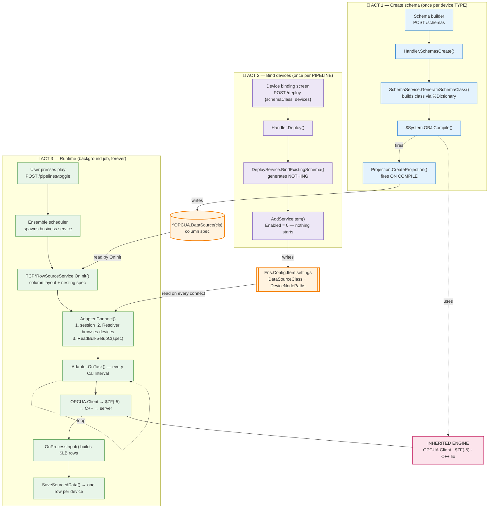
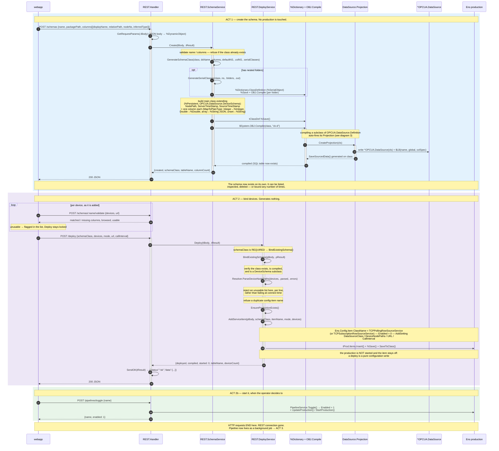
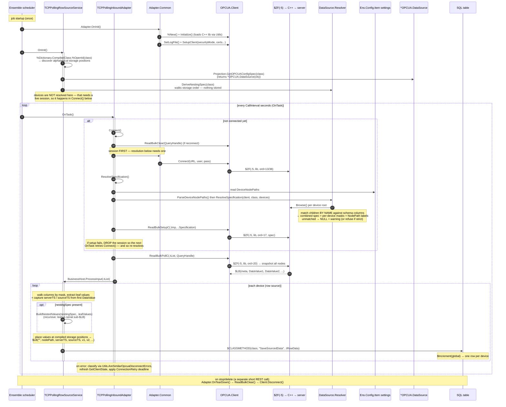
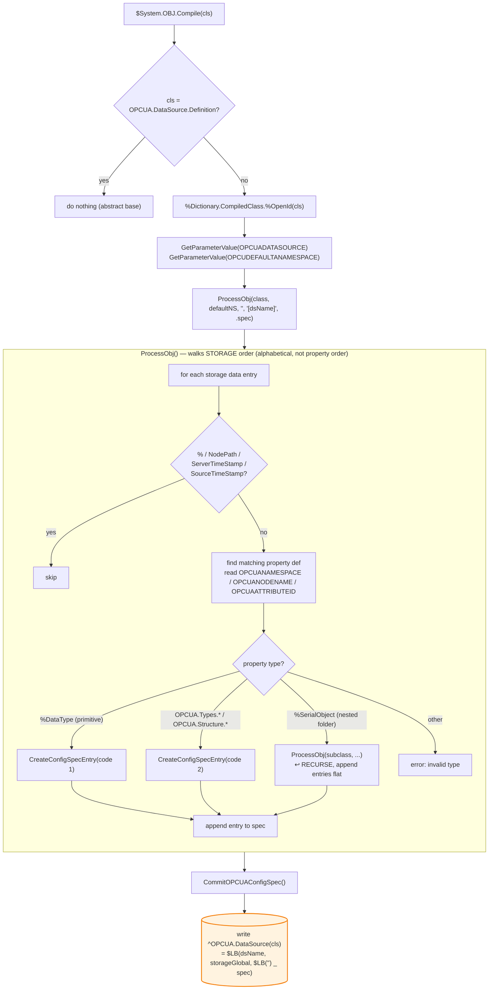

# End-to-End Workflow — Mermaid Diagrams

> Detailed call-level trace of the IRIS OPC UA Adapter, from creating a schema to a
> running poller writing SQL rows.

The system has **three phases**. Schema creation and device binding are separate
operations — that split is the point, and it is why "add a device" is a settings edit:

- **ACT 1 — Create schema** (`POST /schemas`): generates + compiles a class. **No
  production, no device information.** Happens once per device *type*.
- **ACT 2 — Bind devices** (`POST /deploy`): **generates nothing.** Adds one production
  item whose settings name the schema and list the devices. Repeatable per schema.
- **ACT 3 — Runtime:** a background job that resolves devices **by name on every
  connect**, then polls forever.

ACT 1 hands off to ACT 3 through `^OPCUA.DataSource` (the column spec). ACT 2 hands off
through **ordinary production settings** — there is no device metadata global.

---

## 0. High-level overview (three acts + the handoffs)

Because ACT 3's resolution step re-runs on **every** connect, editing `DeviceNodePaths`
in ACT 2's settings takes effect with no recompile, and a device that was unreachable at
startup begins reporting on its own.

ACT 2 ends at a config item, not at a running job. A pipeline is created **stopped**, so
ACT 3 begins only when the operator presses play — deploying and collecting are separate
decisions.

---

## 1. ACTS 1 & 2 — Create schema, then bind devices (detailed call sequence)

---

## 2. ACT 3 — Runtime (detailed call sequence, repeats forever)

---

## 3. The compile-time "magic": Projection (zoom into ACT 1, step ~12)

This fires automatically whenever a `OPCUA.DataSource.Definition` subclass compiles — it's
the seam where the **new** DeployService reuses the **inherited** Projection engine.

---

## Key takeaways

- **One global plus two settings are the entire contract.** `^OPCUA.DataSource` is written by
  the Projection at *compile* time and read in `OnInit()`. Everything about *devices* lives in
  the config item's `DataSourceClass` + `DeviceNodePaths` settings and is re-read on every
  connect. There is deliberately no device-metadata global — an earlier design stored one
  (`^OPCUA.RowSource`), and removing it is what made "add a device" a settings edit.
- **Resolution happens at connect, not deploy.** Column masks and node IDs are derived by
  browsing each device and matching children by name, so the session must be established
  before the spec is built. That ordering is load-bearing in both adapters.
- **The seam to the inherited engine is `$System.OBJ.Compile`** (which fires the inherited
  Projection) and **`OPCUA.Client`** (the `$ZF(-5)` C++ bridge) — both used unchanged.
- **Storage order is alphabetical**, and *both* the Projection (compile) and the service
  (runtime, via `%Dictionary.CompiledClass`) independently rely on that ordering — which is
  why renaming a property silently shifts the spec.
- **`$ZF(-5)` ordinals** (17 = ReadBulkSetupC, 20 = ReadBulkPollC, 13/38 = Connect) come from
  `OPCUA/Constants.inc` and must match the closed-source C++ dispatch table.

